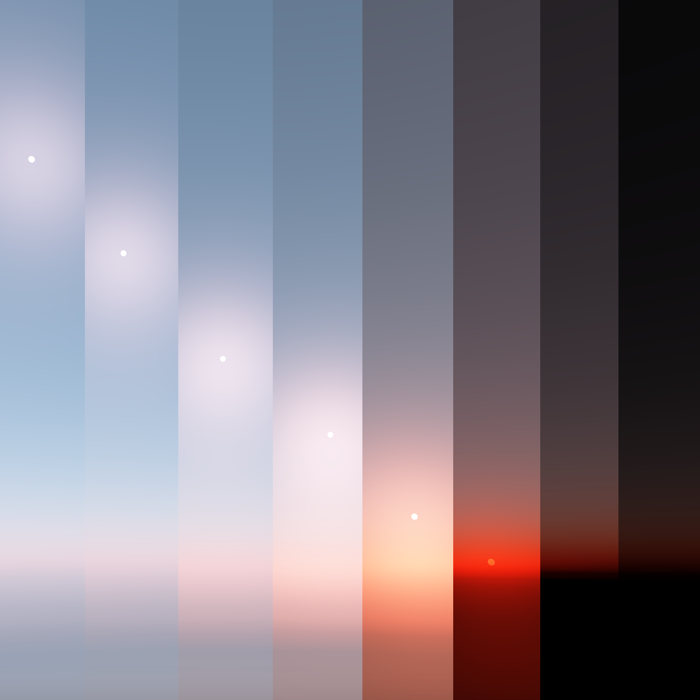
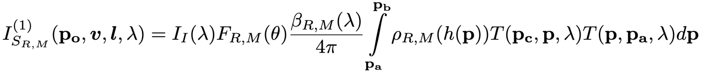

# Atmosphere

## About

This program calculates the color of the sky for a variety of view and sun angles, and stores the results in lookup tables for efficient rendering of realistic and dynamic skies in real-time.

This branch contains the precomputation engine. For an example of using the precomputed data in a renderer, please see this repository's `gh-pages` branch.

## Background

The intensity of a given wavelength of light reaching your eye after undergoing scattering within earth's atmosphere is described by the following equation:

For a more complete understanding of the math behind atmospheric scattering, I would recommend you to read Gustav Bodare and Edvard Sandberg's excellent [thesis](http://publications.lib.chalmers.se/records/fulltext/203057/203057.pdf) on atmospheric scattering.

## How To Use

1. Clone this repository.
2. `cd` into `atmosphere/`
3. Run `make`.
4. Run `./build/atmosphere`, or optionally `./build/atmosphere -o some/output/dir` to specifiy a custom output directory.

The program outputs three files:

1. `rayleigh.bin` contains the precomputed rayleigh scattering results in the form of a binary encoded float array. The array is by default 64*64 floats long.
2. `mie.bin` contains the precomputed mie scattering results in the form of a binary encoded float array. The array is by default 64*64 floats long.'
3. `results.txt` contains the necessary constants to correctly render the atmosphere in your renderer of choice.

Both arrays represent 3x64x64 tables corresponding to 3 wavelengths, 64 view-zenith angles, and 64 sun-zenith angles.

The tables exclude the spectral irradiance `Ii(lambda)` and phase function `F(theta)` terms from the above integral. These must be accounted for during the rendering phase.

The table is normalized into the 0...1 range before being written to the disk. This is to minimize the loss of precision when between double and float types. The values must be un-normalized during the rendering phase.

## Rendering

For a complete example of using the precomputed data in a renderer, please see this repository's `gh-pages` branch. The basic process is outlined below:

1. Load each table as a texture into GPU memory.
2. Convert the current view-zenith angle and sun-zenith angle into texture coordinates `u ` and `v` with the following formulas:
   1. `u = 0.5 * (1.0 + sign(cosViewZenith)*pow(abs(cosViewZenith), 1.0/3.0));`
   2. `v = 0.5 * (1.0 + sign(cosSunZenith)*pow(abs(cosSunZenith), 1.0/3.0));`
3. Sample the rayleigh and mie textures with the calculated texture coordinates from step 2.
4. Un-normalize the rayleigh and mie values with the following formula: `val = val * (max-min) + min`. (`max` and `min` are from `results.txt`).
5. Multiply the rayleigh and mie values with their corresponding phase functions.
6. Add the rayleigh and mie values to get the total scattering.
7. Multiply the total scattering by the spectral irradiance constants from `results.txt` to get the radiance.
8. Multiply the radiance by the spectral to rgb conversion constants from `results.txt`.
9. Tone-map the resulting RGB values.